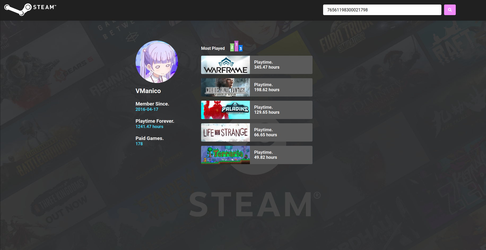
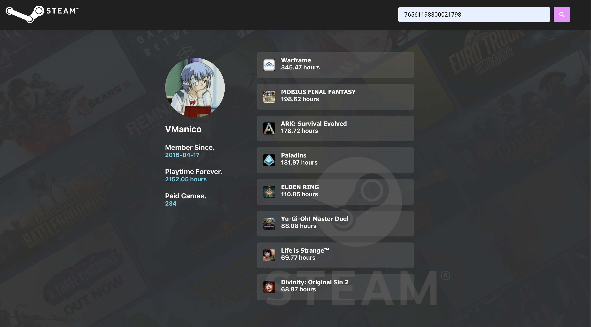

# Steam Profile

Here you can search for a **Steam** user and retrive some data from the **steampowered** API.

## Try it out

You can run by performing these steps:

```
$ git clone https://github.com/VictorBDias/SteamProfile.git
$ yarn
$ yarn start
```
Open http://localhost:3000 to view it in the browser.

## Usage

Enter the user Steam ID on the input box, then submit. You can find the ID on user profile URL:,<br>
**https://steamcommunity.com/profiles/STEAM_ID** <br>

The application is still unable to search for users with custom url, if the user created his url, replace the **CUSTOM_URL_NAME** in the link below with the user name created to redeem the user ID <br>
**http://api.steampowered.com/ISteamUser/ResolveVanityURL/v0001/?key=483F111C4F4707BEC2B4B5639FA3EA8D&vanityurl=CUSTOM_URL_NAME** <br>

# Home
<kbd>
  
</kbd>

# Response
<kbd>
  
</kbd>

<kbd>
  
</kbd>

